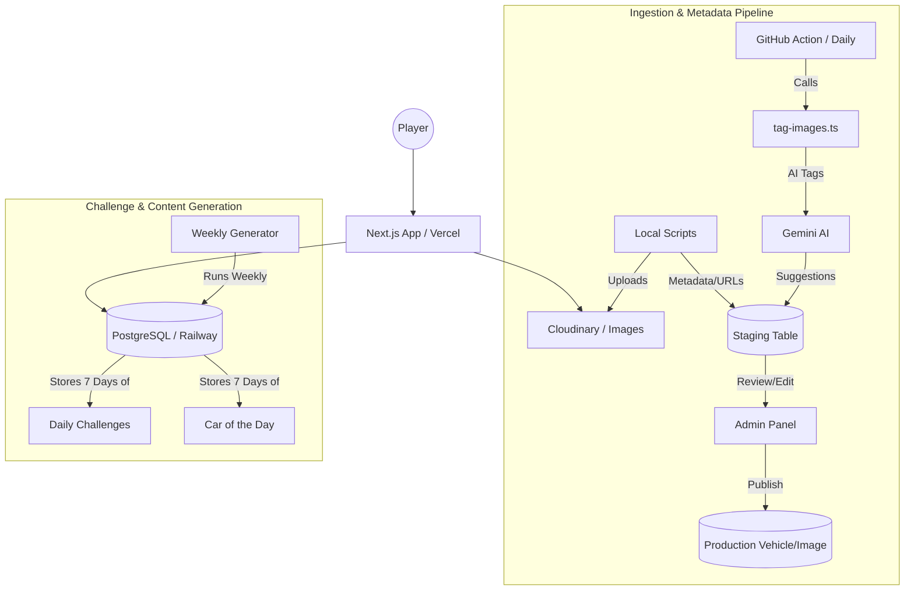
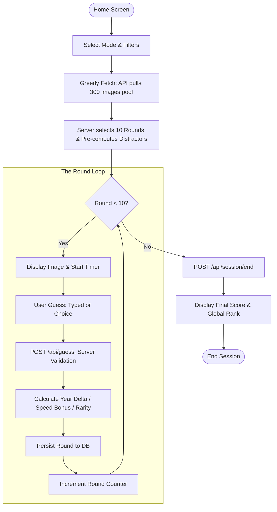
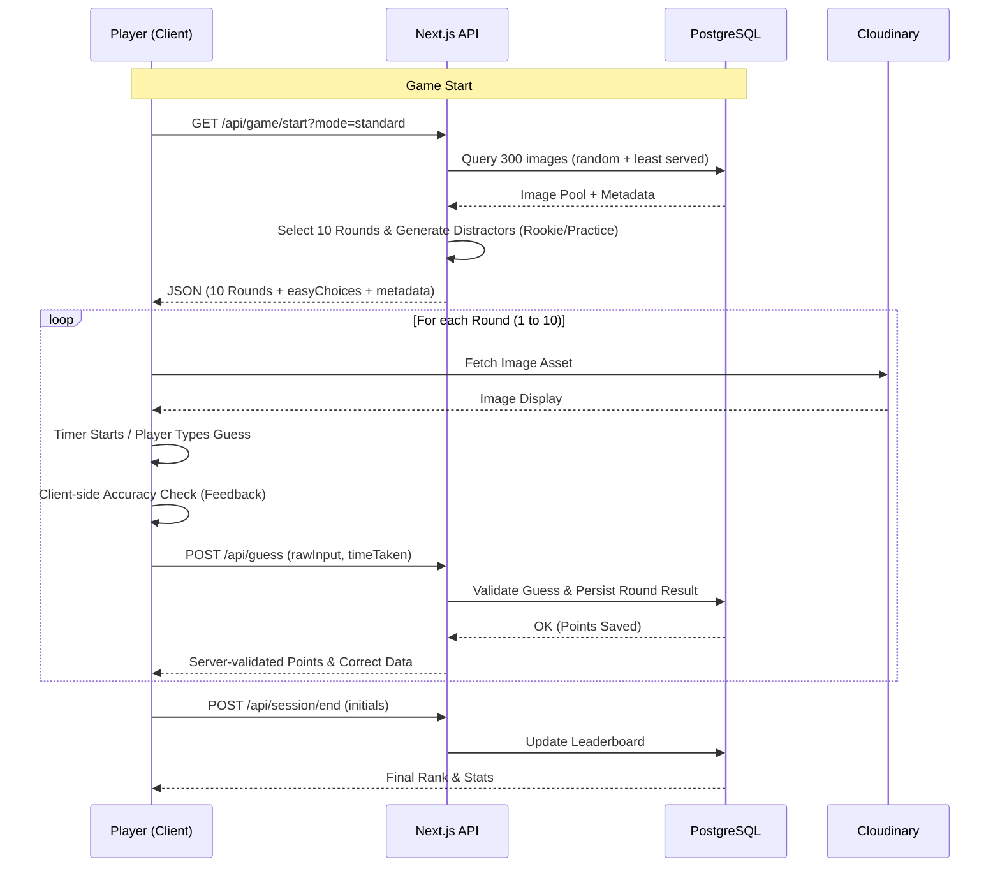
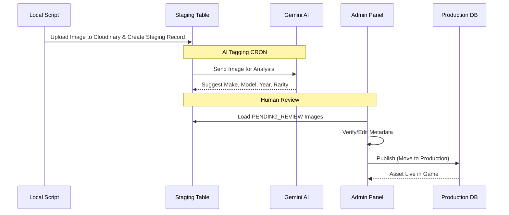
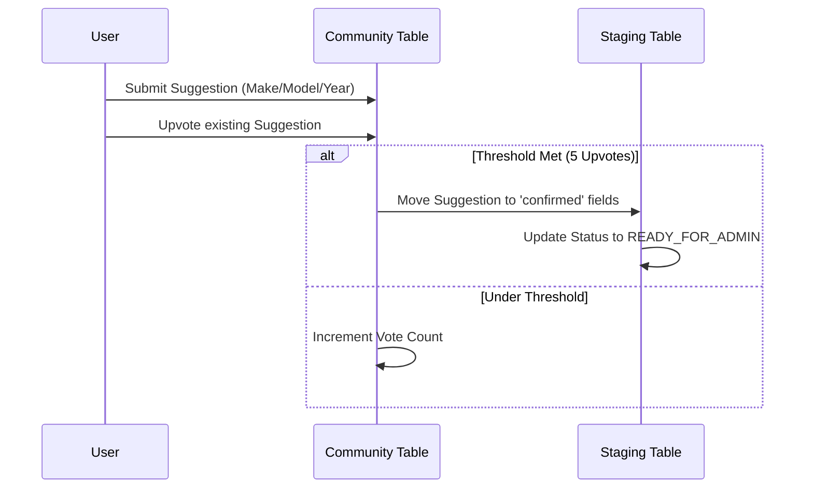

# AutoGuessr — ERD Planning Document

## Overview

### Project Summary

AutoGuessr is a specialized vehicle identification game designed for automotive enthusiasts. Players are presented with images of cars and must accurately identify the make, model, and year within specific time limits to score points. The platform features multiple game modes (Rookie, Standard, Hardcore, and Time Attack), a **Daily Challenge**, a **Car of the Day**, and a community identification pipeline for obscure vehicles. Behind the scenes, there is an admin panel for managing images and an AI-driven ingestion system using Gemini for automated metadata tagging.

### Context

While location-based guessing games like GeoGuessr have achieved massive popularity, a high-fidelity equivalent for the automotive world—where identification relies on subtle design cues, regional variants, and historical era—remains a significant gap in the market. AutoGuessr aims to fill this void by combining a large-scale, curated image database with competitive mechanics and community-sourced knowledge to create the definitive "car nerd" experience.

## Goals

## Scope

AutoGuessr encompasses both a competitive player experience and a sophisticated administrative pipeline for content curation.

**The Player Experience:**
The game features four core difficulty modes (Rookie, Standard, Hardcore, and Time Attack) where users earn points and compete for positions on global leaderboards. A **Daily Challenge** provides a synchronized competitive experience with fixed image sets, while **Car of the Day** highlights a specific vehicle with unique trivia. A "Practice" (Garage) mode allows for low-stakes exploration, and "Custom" games enable players to filter the vehicle pool. Scoring is dynamic, rewarding speed, accuracy, and the identification of rare or difficult vehicles.

**Community & Curation:**
Beyond the core game, the scope includes a community-driven "Identification" platform where players collaborate to tag obscure images. This is supported by an automated ingestion pipeline that utilizes Gemini AI for initial metadata generation, followed by a gated Admin Panel for human verification and performance analytics.

## Requirements

- From the home screen, a user can:
  - Click to select a game mode and start a new game
  - Enter the Daily Challenge
  - View the Car of the Day
  - Click to see the leaderboards
  - Click to view information about how points are scored
  - Click to view the terms of service and privacy policy
  - Click to view the images open to community identification
- A game consists of 10 rounds, each is an image of a different car.
- There are 6 game modes:
  - Rookie - easiest, lowest scoring points, multiple choice answers
  - Standard - middle difficulty, scores more points, user must type answers.
  - Hardcore - hardest difficulty, image is obscured and slowly revealed.
  - Time Attack - focus on speed.
  - Garage - practice mode, no points scored.
  - Custom - user-selected filters (region, era, etc.).
- **Daily Challenge:**
  - A fixed set of 10 images, identical for every player, resetting at UTC midnight.
  - Uses Rookie (multiple-choice) scoring rules.
  - **Bonus Points:** Includes a +1000 point bonus for any `hardcore-eligible` images included in the set.
  - **Dynamic Leaderboards:** Each challenge has a unique leaderboard. A score is eligible if the session has `initials` set and is linked to the `challengeId`.
  - **Archive System:** Users can browse an "Archive" list. Playing a past challenge submits a score to that specific date's leaderboard, but is flagged as `isArchivePlay: true` to distinguish "live" vs "late" entries.
  - **Streaks:** Consecutive daily challenge completions are tracked via cookie and persisted to the user profile.
- **Car of the Day:**
  - One featured vehicle per day, showcased on the landing page.
  - Includes a "Did you know?" trivia section (AI-generated or admin-curated).
  - Info only, no competitive element.
  - A bonus is awarded if the CotD is guessed correctly during a game.
- After a user has made their guess, the round is over. The user can continue, report a problem, or rate the image.
- A gated admin panel lets an admin manage the lifecycle of images and vehicles.
- The community identification panel allows users to propose and upvote vehicle metadata.

---

## Technical Implementation

## Design & Architecture Overview

AutoGuessr is a full-stack Next.js (App Router) application deployed on Vercel, utilizing a PostgreSQL database (Railway/Neon) and Cloudinary for media asset management.

### System Architecture

### Game Session Flowchart
This diagram tracks the lifecycle of a single player session from the home screen to the leaderboard.

### Core Game Engine
- **Greedy Fetch & Distractor Generation:** At game start, the server queries a pool of ~300 images (weighted toward least-served). For Rookie/Practice modes, the server generates **distractors** (easyChoices) by selecting unique make+model pairs from this same 300-image pool. The entire payload (10 rounds + choices + pool metadata) is sent in one request.
- **Guess Validation Flow:** 
    1. **Client:** Player submits a guess (text or multiple choice).
    2. **API:** Next.js receives `rawInput` and `timeTaken`.
    3. **Server:** Logic calculates `yearDelta`, `partialCredit`, and point bonuses (Rarity, Time, Hardcore).
    4. **Persistence:** The `Guess` and `Round` are updated in the DB, and the response triggers the next round on the client.
- **Edge Performance:** **Car of the Day** and **Daily Challenge** data are served via ISR (Incremental Static Regeneration). Since the data is pre-generated weekly, the Edge Cache refreshes daily at UTC midnight with near-zero database overhead.

### Image Ingestion Pipeline
1. **Upload:** Local scripts (`stage-images.ts`) scan a local folder, upload images to Cloudinary, and populate the `StagingImage` table with filenames and source URLs at a `PENDING_REVIEW` status.
2. **AI Furnishing:** A GitHub Action runs daily calling `tag-images.ts`. This script finds untagged staging images and sends them to Gemini 2.5 Flash to populate:
    - **Metadata:** `aiMake`, `aiModel`, `aiYear`, `aiTrim`, `aiBodyStyle`, and `aiConfidence`.
    - **Visual Flags:** `isCropped`, `isLogoVisible`, `isModelNameVisible`, `hasMultipleVehicles`, `isFaceVisible`, and `isVehicleUnmodified`.
3. **Curation:** Admins use the Admin Panel to verify AI suggestions or community input.
4. **Publication:** Publishing an image moves it to the production `Image` table and links/creates the associated `Vehicle`.

### Scalable Leaderboard Architecture
To manage 365+ leaderboards per year without creating separate tables:
- **Relational Anchor:** Each `DailyChallenge` record acts as the parent for thousands of `GameSession` records.
- **Index Optimization:** A composite index on `(challengeId, finalScore DESC, initials)` allows near-instant retrieval of the Top 100 for any specific day.
- **Integrity:** The `isArchivePlay` flag allows the UI to separate "The Original Top 10" (players who played on the actual day) from the "All-Time Top 10" for that specific image set.
- **Deduplication:** To prevent leaderboard spam, only the *first* completed session per user per `challengeId` is eligible for the global rank, while subsequent tries are marked as practice.

## Tradeoffs and Rationales

Opted to use typescript because it enables the game to run without a backend server.

At game start, the frontend queries the DB to find a pool of images and selects 10 that qualify for the mode.

Updates to stats (serves, ratings) are fire-and-forget to minimize round-trip delays.

## Technical Workflows

### Game Play & Scoring Sequence
This diagram illustrates the "Greedy Fetch" and the dual-validation scoring system.

### Ingestion & AI Pipeline
How a raw photo becomes a playable game asset.

### Community Identification Loop
The workflow for crowdsourcing obscure vehicle data.

---

## Tables

### `players` (Users)

Registered players and admins.

- `id` — primary key
- `username` — unique
- `role` — e.g. `player`, `admin`
- `dailyStreak` — current number of consecutive days played
- `maxStreak` — historical best streak
- `createdAt`, `lastSeenAt`
- **Related:** `PlayerStats`, `PlayerDimensionStats`

---

### `vehicles`

The core catalogue.

- `id` — primary key
- `make`, `model`, `year`, `trim`
- `countryOfOrigin`, `regionId` (FK to `Region`)
- `bodyStyle`, `era`, `rarity`
- **Related:** `VehicleAlias`, `Category`

---

### `images`

Published images served to players.

- `id` — primary key
- `vehicleId` — FK to `vehicles`
- `filename`, `sourceUrl`, `attribution`
- **Flags:** `isCropped`, `isLogoVisible`, `isModelNameVisible`, `hasMultipleVehicles`, `isFaceVisible`, `isVehicleUnmodified`
- `isHardcoreEligible` — boolean
- `isActive` — boolean
- **Related:** `ImageStats`

---

### `daily_challenges` [NEW]

Fixed seeds for the synchronized daily game.

- `id` — primary key
- `date` — unique date (YYYY-MM-DD)
- `imageIds` — array of 10 `image` IDs
- `totalPlayers` — integer (cached for stats)
- `averageScore` — float (cached for stats)

---

### `featured_vehicles` [NEW]

Tracks the Car of the Day.

- `id` — primary key
- `vehicleId` — FK to `vehicles`
- `date` — unique date
- `trivia` — string (markdown supported)

---

### `staging_images`

The ingestion pipeline for new images.

- `id` — primary key
- `cloudinaryPublicId`, `filename`
- **AI Suggestions:** `aiMake`, `aiModel`, `aiYear`, `aiConfidence`, `aiTaggedAt`
- **Admin Overrides:** `adminMake`, `adminModel`, `adminYear`, `adminTrim`, etc.
- `status` — enum: `PENDING_REVIEW`, `COMMUNITY_REVIEW`, `READY`, `PUBLISHED`, `REJECTED`
- **Related:** `CommunityIdentification`, `CommunityVote`

---

### `game_sessions`

One row per game played.

- `id` — primary key
- `playerId` — FK to `players`
- `challengeId` — nullable FK to `daily_challenges`
- `mode` — enum (rookie, standard, hardcore, daily_challenge, etc.)
- `isArchivePlay` — boolean (true if playing a past daily challenge)
- `filterConfig` — JSON
- `finalScore`, `initials`
- `startedAt`, `endedAt`

---

### `rounds` & `guesses`

- **`rounds`**: Tracks image and sequence.
- **`guesses`**: Tracks input, accuracy, and detailed points (`makePoints`, `modelPoints`, `yearBonus`, `timeBonus`, `proBonus`).

---

## Relationships Summary

| From                | To                 | Type | Notes                    |
| :------------------ | :----------------- | :--- | :----------------------- |
| `players`           | `game_sessions`    | 1:N  |                          |
| `game_sessions`     | `rounds`           | 1:N  |                          |
| `rounds`            | `guesses`          | 1:1  |                          |
| `images`            | `vehicles`         | N:1  |                          |
| `game_sessions`     | `daily_challenges` | N:1  | For Daily Challenge runs |
| `featured_vehicles` | `vehicles`         | N:1  | For Car of the Day       |

---

## Tables to Drop / Ignore

- [ ] Add table names here before handing off

---

## Future Features

### Travel Mode

A specialized game mode focusing on the automotive landscape of specific countries or regions.

- **Initial Launch:** **China** (focusing on domestic brands like BYD, NIO, XPeng, and Geely).
- **Mechanics:** Users select a destination from a world map or list. The game serves images exclusively from that country's domestic market or vehicles commonly found there.
- **Educational Component:** Includes brief descriptions of local brands and their history during the results screen.

---

## Risks and Mitigation

## Security & Privacy

API calls are rate limited. Usernames/initials are the only PII.

## Monitoring, Alerting, Observability

Track challenge completion rates and ingestion pipeline success.

## Operational Considerations

Daily cron job to generate `daily_challenges` and `featured_vehicles`.
